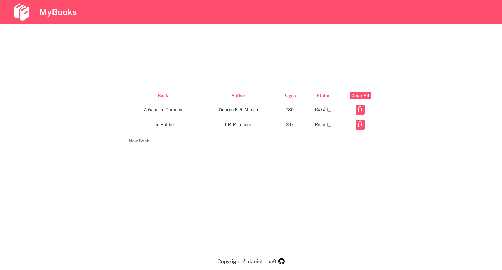

# MyBooks

## Introduction
MyBooks consists on a webpage library that allows the user to input and store book's info.   
This project was built with plain HTML, CSS and Javascript and it is part of [The Odin Project's curriculum](https://www.theodinproject.com/).

## Screenshot

## Live Demo
This project is hosted on my GitHub Pages and you can access it [in here](https://daniellima0.github.io/mybooks/).

## Key Concepts
* Display Table (CSS3)
* DOM Manipulation
* Objects
* Objects Constructors
